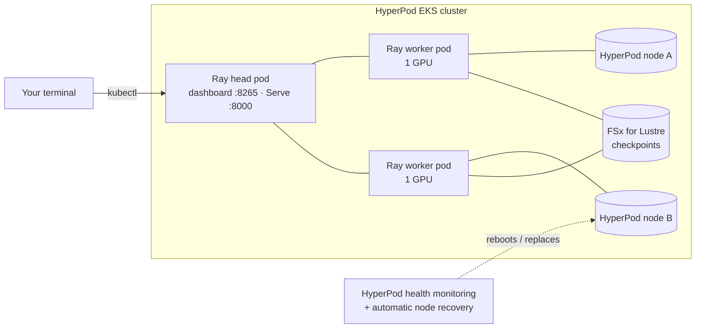

# Ray on Amazon SageMaker HyperPod — Hands-on Workshop

Run Ray on a HyperPod cluster orchestrated by Amazon EKS: train across GPU nodes, **break a node on purpose
and watch training resume from its checkpoint**, then serve a model that autoscales under load.

| | |
|---|---|
| **Audience** | ML engineers and platform engineers who know basic Python and `kubectl` |
| **Time** | ~2.5 hours (Modules 0–4); Module 5 is optional |
| **You need** | A HyperPod EKS cluster with **2+ GPU nodes** (defaults sized for `ml.g5.2xlarge`), an FSx for Lustre PVC, and `kubectl`, `helm`, `aws`, `python3` |
| **You do not need** | Docker, a custom container image, or Ray installed on your laptop |



## Modules

| # | Module | What you do | Time |
|---|---|---|---|
| 0 | [Setup](00-setup/README.md) | Check prerequisites, install the KubeRay operator | 15 min |
| 1 | [Your first Ray cluster](01-first-ray-cluster/README.md) | Create a RayCluster, open the dashboard, see where Ray runs your code | 25 min |
| 2 | [Distributed training](02-distributed-training/README.md) | Ray Data + Ray Train (PyTorch DDP) across GPU nodes with checkpoints on FSx | 30 min |
| 3 | [Resilience](03-resilience/README.md) | Reboot a node mid-training; HyperPod recovers it and Ray Train resumes | 30 min |
| 4 | [Ray Serve under load](04-ray-serve/README.md) | Deploy a sentiment API, load-test it, watch replicas autoscale | 30 min |
| 5 | [Observability (optional)](05-observability/README.md) | Ray metrics with the HyperPod Observability add-on | 15 min |
| — | [Cleanup](99-cleanup/cleanup.sh) | Remove everything the workshop created | 5 min |

## Quick start

```bash
git clone <this repo> && cd ray-hyperpod-workshop
vi env.sh                               # set NAMESPACE, FSX_PVC, HYPERPOD_CLUSTER_NAME, AWS_REGION
./00-setup/check-prereqs.sh
./00-setup/install-kuberay.sh
./01-first-ray-cluster/create-cluster.sh
./01-first-ray-cluster/run-hello.sh
```
Then follow each module's README. Every script reads `env.sh`, prints what it is doing, and is safe to re-run.

## How the workshop is built

- **Upstream Ray and KubeRay, unchanged.** Ray on HyperPod runs the open-source KubeRay operator and custom
  resources as-is; everything here is plain `ray.io/v1` resources and standard Ray APIs.
- **No image builds.** The stock `rayproject/ray` GPU image is used; PyTorch and Transformers are installed per job
  through Ray runtime environments (cached on each node after the first job).
- **No local Ray install.** Scripts copy your code into the head pod and submit it with the Ray Jobs CLI there.
- **Pinned versions** (`env.sh`): Ray 2.58.0, KubeRay 1.7.1, PyTorch 2.7.1, Transformers 4.56.2.

## Cost

You pay for the HyperPod instances for as long as they run, plus FSx storage. Run
`./99-cleanup/cleanup.sh` when you finish, and delete or scale down the HyperPod cluster if you created it only for
this workshop. Check current [SageMaker HyperPod pricing](https://aws.amazon.com/sagemaker/ai/pricing/) for your
instance type and Region.

## Validation status

See [tests/README.md](tests/README.md) for what was verified and how. In short: the scripts pass `shellcheck`,
the rendered RayCluster validates against the KubeRay v1.7.1 CRD schema, and the Ray code paths (tasks, actors,
Ray Train retry-and-resume, Serve deployment via a job, autoscaling, the load generator) were run on a local Ray
2.58.0 cluster. **Run the full workshop once on a HyperPod cluster before delivering it.**

## Further reading

- [Ray on SageMaker HyperPod](https://docs.aws.amazon.com/sagemaker/latest/dg/sagemaker-hyperpod-ray.html) (AWS docs)
- [Automatic node recovery with Ray](https://docs.aws.amazon.com/sagemaker/latest/dg/sagemaker-hyperpod-ray-node-recovery.html)
- [Ray Train on HyperPod EKS](https://awslabs.github.io/ai-on-sagemaker-hyperpod/docs/eks-orchestration/training-and-fine-tuning/ray-train/ray-train-readme) (AI on SageMaker HyperPod: FSDP with PyTorch Lightning and a custom image)
- [Ray documentation](https://docs.ray.io/)
